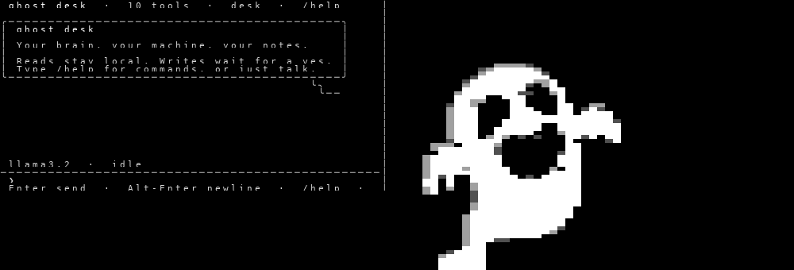
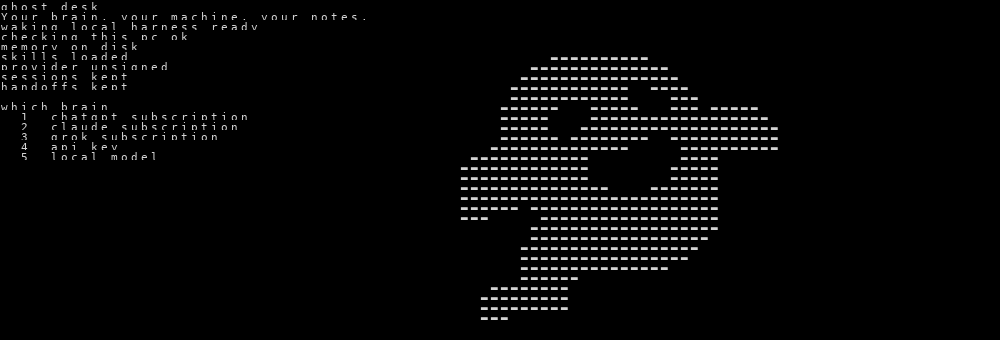

# Ghost Desk

Local terminal agent. one ghost, your machine, your notes.



Ghost Desk lives in your terminal. It reads what's on your machine, remembers
what matters, and does the work — but it plans before it builds, and writes
nothing until you approve.

## The safety model

Three rules, enforced in code, not in prompts:

- **Reads stay local.** Shell, files, and memory all run on this machine.
- **Writes wait for a yes.** Any file write, edit, or shell command that changes
  state asks first. The plan is shown up front; nothing is written until you
  approve it.
- **Memory stays on disk.** Sessions, notes, and lessons live in
  `~/.ghost-desk/`. Nothing phones home.

## Brains

Pick a brain for the ghost on first boot — or switch anytime with `/model`:



| # | Brain | What it needs |
|---|-------|---------------|
| 1 | ChatGPT / Codex subscription | OAuth sign-in |
| 2 | OpenAI API key | Your own key |
| 3 | Claude subscription | OAuth sign-in |
| 4 | Grok subscription | OAuth (SuperGrok / Premium+) |
| 5 | Grok API key | Your own key |
| 6 | Local model | Ollama on `127.0.0.1:11434` — fully offline |
| 7 | OpenRouter / OpenAI-compatible | Your own key and URL |

## Tools

Ten tools, no more: `shell`, `file_read`, `file_write`, `file_edit`,
`http_fetch`, `web_search`, `open`, `clipboard`, `little_ghost`,
`close_ghosts`.

`little_ghost` splits a task across parallel subagents when a job is big
enough to deserve it. Every tool call is checked after it runs, and the work
is re-read against the plan before it's called done.

## Memory

- **Sessions** persist per conversation — `/sessions` lists them,
  `/resume` picks one back up.
- **Notes** are verified facts the desk keeps — `/memory` shows recent ones,
  `/recall` searches everything ever said.
- **Lessons** start as drafts. Correct the desk ("no, do it this way") and the
  correction is staged, not applied — `/promote` saves it into memory.
- **Haunts** are domains the ghost knows; **wisps** are small spirits under them
  and **whispers** are filed tricks. Whispers gather, wisps manifest, and the
  **seance** (`/seance`) merges wisps, lays the dead to rest, and rewrites each
  haunt from what its wisps have become — the haunting deepens on its own.
- **Background jobs** run on a schedule — `/bg add <schedule> <prompt>`,
  `/bg digest` reads what they found.

## Commands

`/help` lists everything in the terminal. The ones you'll use most:

```text
/new          start a fresh conversation
/plan         show the current plan
/model        show or switch the model
/memory       recent verified notes
/recall       search past sessions
/resume       continue a session
/promote      save the newest correction into memory
/bg           background jobs
/quit         leave
```

Enter sends. Alt-Enter inserts a newline. Ctrl+C cancels the current turn.

## Install

### Mac and Linux

```bash
curl -fsSL https://raw.githubusercontent.com/HassanForged/ghost-desk/main/install.sh | bash
```

Then open a new terminal:

```bash
ghost
```

Needs Git. On a Mac with system Python 3.9 that's fine — the installer fetches
Python 3.12 for Ghost Desk only (no Homebrew) and puts `ghost` in
`~/.local/bin`. If `ghost` isn't found:

```bash
export PATH="$HOME/.local/bin:$PATH"
```

### Windows

```powershell
git clone https://github.com/HassanForged/ghost-desk.git
cd ghost-desk
python -m venv .venv
.venv\Scripts\Activate.ps1
pip install -e .
ghost
```

## Try this

```text
build a one-page site for you@example.com
```

Ghost Desk must show a plan and write nothing until you approve. That's the
whole product in one sentence.

## The ghost

The mascot is pixel art drawn from the ghost PNG: hard-quantized to the
cartoon's own tones (black lines, two shading grays, white body), so every
pixel lands crisp. No blur, no speckle.

Terminals that can show real images (Kitty, Ghostty, WezTerm, iTerm2, VS Code)
can opt into the literal picture instead with `GHOST_DESK_IMG=kitty` or
`GHOST_DESK_IMG=iterm2`.

The session is one calm, centered column: a small ghost portrait up top with
autumn leaves drifting past, your messages in right-aligned bubbles, the
ghost's replies as plain text, and a rounded input pill at the bottom. Press
1, 2, or 3 on the empty screen to try a suggestion, or `/new` for a fresh
thread.

A few autumn leaves drift past the ghost, one every few seconds — slow,
sparse, and quiet, never more than five at once. `GHOST_DESK_LEAVES=off`
turns them off.

## Develop

```bash
python -m venv .venv && . .venv/bin/activate
pip install -e ".[dev]"
pytest tests/ -q
```
